Architectural Analysis 

- **What part of system is going to be analysed?** 

We are going to analyse a part of the system where  User Management, Content Management & Subscription Management systems are being used. 

Implementation of this part of system is done such that user can login to the system or can create a new account. Hence, login and signup services are available.  

User can view all OTT providers and the contents which are provided by them. User (supposed to be Admin) can also add new OTT platforms and contents for other actual users to see and subscribe.  

Users can subscribe to the contents provided by these platforms and they can view the contents to which they have subscribed to. 

PFB some screenshots on the working of the system implemented: (Will be using these two for all the further NFR measurements) 

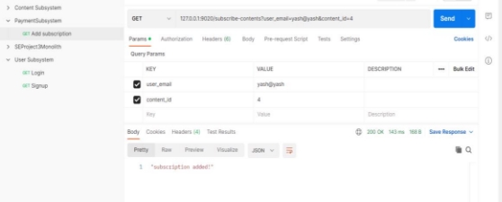

Fig 11: User subscribing to a content 

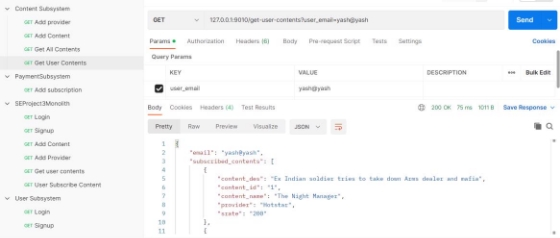

Fig 12: User viewing subscribed contents 

- **What quality attributed will be analysed?** 

We are going to perform quantitative analysis on the following quality attributes: 

1. Latency 
1. Resource Usage 
1. Throughput 
1. Response Time 

*Quantitative analysis* involves the use of mathematical and statistical techniques to analyse data and make predictions. It relies on objective, measurable data to draw conclusions and make informed decisions.  

- **Mention the pattern being used for comparison and why?** 

Monolithic layered pattern and microservices pattern are two different architectural approaches, each with its own strengths and weaknesses. Therefore, the choice between the two depends on the specific needs and requirements of the CineStream platform, especially the non-functional requirements. Both can be used to implement CineStream, but they differ in their approach of handling the various components of the platform. 

For a monolithic layered pattern, the application is structured as a single, self-contained unit that contains all the modules and components required to run the platform. Each layer in the application is responsible for a specific set of tasks, and the layers are tightly coupled to one another.  

On the other hand, a microservices architecture is based on the concept of breaking down the application into smaller, independent services, each responsible for a specific function. This approach allows for greater flexibility and scalability, as each service can be developed and deployed independently of the others 

To implement CineStream using a monolithic layered pattern, you could organize the application into layers based on its different functions, such as user management, content management, and streaming. Each layer would have its own set of modules and components, and the layers would communicate with each other through well-defined interfaces. 

To implement CineStream using a microservices architecture, you could break down the platform into a set of smaller, independent services. For example, you could have one service for user management, another for content management, and a third for streaming. Each service would have its own set of APIs and interfaces, and they would communicate with each other using standardized protocols such as REST. 

- **Results of Analysis and Inference** 
1. Resource Usage 

We have analysed resource usage by running multiple instances of Monolithic and Microservices versions of system. CPU% utilization and Memory% utilization was look upon while analysing this non-functional requirement.  

*Windows Task Manager was used to capture the utilization %. After running each instance, the values were captured and plotted on the graph.* 

The below graphs show plot of no. of instances (X-axis) and CPU% utilization (Y-axis) & Memory% utilization (Y-axis). We have three services in the microservices implementation. When we say ‘x’ instances, that means ‘x’ instances of monolithic system and ‘x’ instances of 3 services each. 

CPU% utilization measures the percentage of time that the CPU is busy executing instructions, while Memory% utilization measures the percentage of physical memory currently being used by the system. 

When comparing 10 instances of a monolithic system with 10 instances of 3 microservices each, the CPU% utilization is more than twice as high for the monolithic system, and the memory % utilization is also lower for microservices. This is because all the services in a monolithic system are tightly coupled and run on the same instance, making any changes to one service affect all the other services. On the other hand, microservices can be independently auto-scaled, which is not possible in a monolithic system. Hence, in general, CPU% utilization and Memory% utilization will be higher for a monolithic system compared to microservices. 

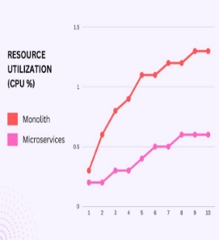 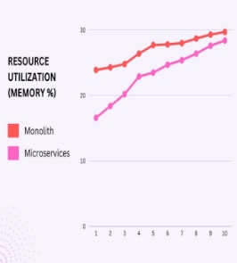

Fig 13 & 14: Resource Utilisation Graphs 

For the next three performance metrics (Latency, Throughput, Response Time), we have analysed by sending multiple requests simultaneously to the monolithic and microservices system to do load and performance test and hence calculating these metrics and comparing them. (Metrics here are analogous to NFRs) 

We have used *Apache Jmeter* to send these requests simultaneously and perform testing. 

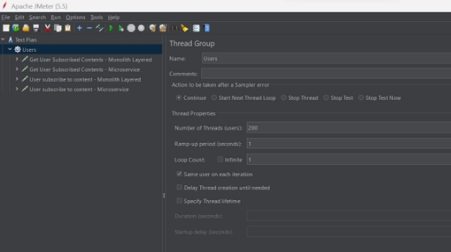

We analysed two functions: *Get User Subscribed Contents* and *User Subscribe to Content*. We sent 200 requests simultaneously to these functions in microservices and monolithic layered system to analyse these for each API and type of system. Both functions* in microservices system have a call chain of 3 i.e., they interact with other services via REST APIs. All calls in monolith are local. 

2. Latency 

Latency is the duration that a request is waiting to be handled – during which it is latent, awaiting service. Latency measurements are used for diagnostic purposes. 

Following are the results for Get User Subscribed Contents (Monolithic and Microservices): 

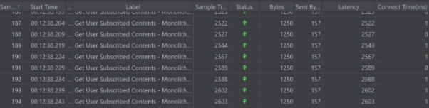

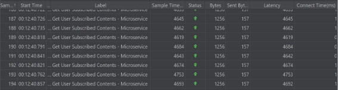

We can clearly see that the latency for function in microservices system is higher as compared to the monolithic layered system.  

A monolith has no network latency, as all calls are local. Even in a perfectly parallelizable world, the monoliths will still be faster. The way to fix this issue is reducing call chain length, using fan-out and keeping data as local as possible. Similarly for the other function: 

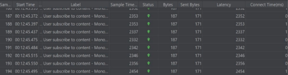

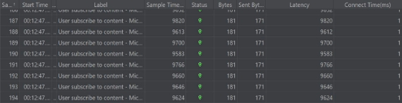

3. Throughput 

Throughput indicates the number of transactions per second an application can handle, the number of transactions produced over time during a test. 

Below are the throughputs of both functions for each system (monolith & microservice): 

We can see that throughput for Microservices is less than monolith. This is because In workloads that cannot run concurrently across the network, monoliths may deliver better performance. Data needs to sent between services and also all the infrastructure induces a certain overhead. If the workload cannot be scaled to multiple instances, a monolith can deliver a higher throughput. 

4. Response Time 

Response time is the amount of time it takes for a service to process a request and send a response back to the client. The response time period begins when the client initiates a request to the service and ends when the client receives a response from the service. 

Following graphs shows the response time as the number of simultaneous requests to each service in each system increases: 

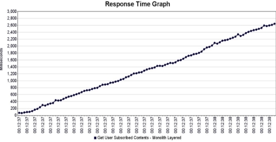

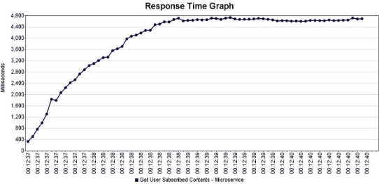

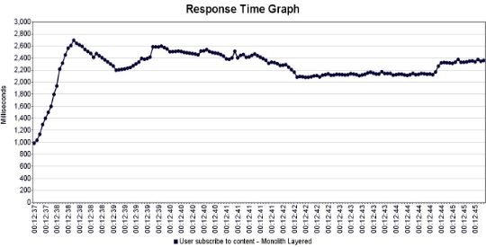

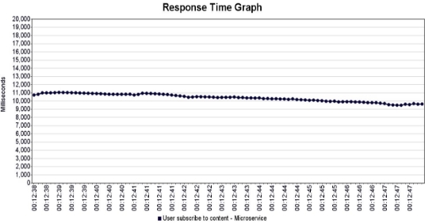The Response time is lower for microservices as compared to monolith. This is because, all the calls in the monolith are local calls with no network latency which is not the case with microservices. Also, as all the data is stored on separate DBs, generating response and sending it back to client takes more time in microservices.  

- **Trade-offs between the two patterns used** 

Monoliths are simpler, have lower latency, response time and higher throughput is most of the scenarios. 

Microservices, on the other hand, are more reliable, have less resources utilization and are easier to scale. 

If we consider the heuristic analysis of some NFRs like time to market or accepted complexity in development, microservices perform better as compared to monoliths as they are easier to develop by breaking into multiple tasks which can be done multiple teams independently. Thus, the complexity reduces and the time to market also reduces as multiple teams are working concurrently. 

These are the trade-offs between microservice and monolith but our choice will be **Microservices** for developing this application 
